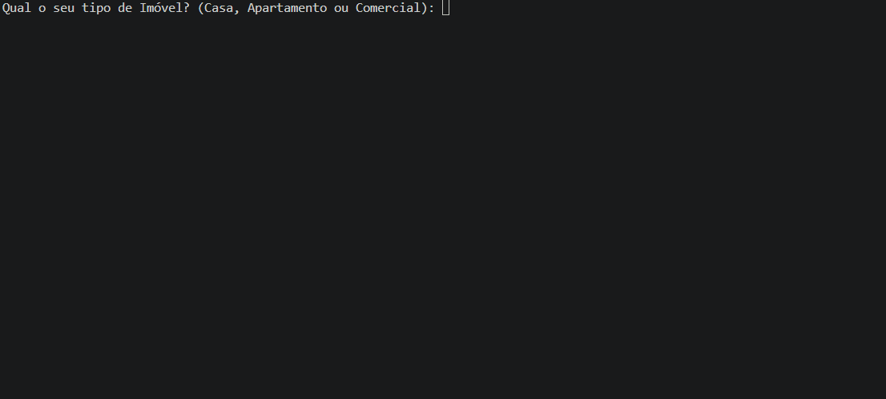

# 💧 Classificador de Consumo de Água

Um programa simples desenvolvido em **Python** para classificar o consumo de água de acordo com o tipo de imóvel informado pelo usuário.

O projeto foi desenvolvido como uma prática de **lógica de programação**, utilizando estruturas condicionais e repetição.

## 📌 Sobre o projeto

O programa solicita ao usuário:

* 🏠 Tipo de imóvel: Casa, Apartamento ou Comercial
* 💧 Consumo de água em metros cúbicos (m³)
* 🔄 Se deseja realizar uma nova classificação

Depois das informações serem inseridas, o programa classifica o consumo como:

* **Consumo econômico**
* **Consumo moderado**
* **Consumo excessivo**

Para imóveis comerciais, o programa também informa que o usuário deve consultar o **plano corporativo**.

## 🛠️ Tecnologias utilizadas

* 🐍 Python
* 💻 Terminal / Prompt de Comando
* 🧠 Lógica de programação

## 📚 Conceitos praticados

Neste projeto foram utilizados conceitos básicos de Python, como:

* `input()`
* `print()`
* `if`, `elif` e `else`
* `while`
* Operadores de comparação
* Operadores lógicos
* Conversão de dados com `float()`
* `.strip()`
* `.lower()`
* Estruturas de repetição

## ⚙️ Como executar

### 1. Clone o repositório

```bash
git clone https://github.com/SEU-USUARIO/SEU-REPOSITORIO.git
```

### 2. Entre na pasta do projeto

```bash
cd SEU-REPOSITORIO
```

### 3. Execute o programa

```bash
python main.py
```

> Dependendo da instalação do Python no Windows, também pode ser necessário utilizar `python3 main.py`.

## 🖥️ Exemplo de utilização


```

## 📊 Classificação do consumo

| Consumo         | Classificação |
| --------------- | ------------- |
| Até 10 m³       | 💧 Econômico  |
| De 10 até 25 m³ | 📊 Moderado   |
| Acima de 25 m³  | ⚠️ Excessivo  |

Para imóveis comerciais, além da classificação, o programa informa:

```text
Consulte o plano corporativo
```

## 📁 Estrutura do projeto

```text
classificador-consumo-agua/
│
├── main.py
└── README.md
└── assets
```

## 🎯 Objetivo

O objetivo deste projeto é praticar os fundamentos da programação em Python, principalmente:

* Entrada de dados
* Processamento de informações
* Estruturas condicionais
* Estruturas de repetição
* Validação básica de informações

## 👨‍💻 Autor

**Renan Henricson**

